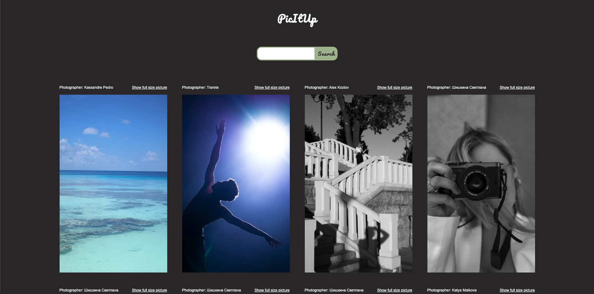
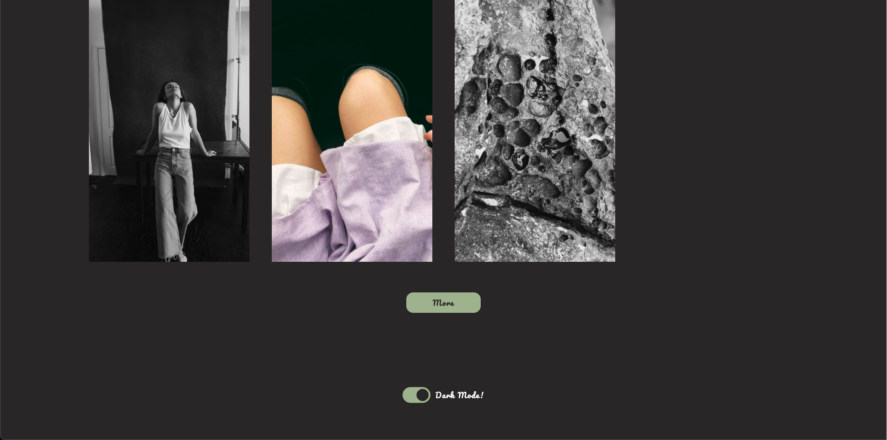
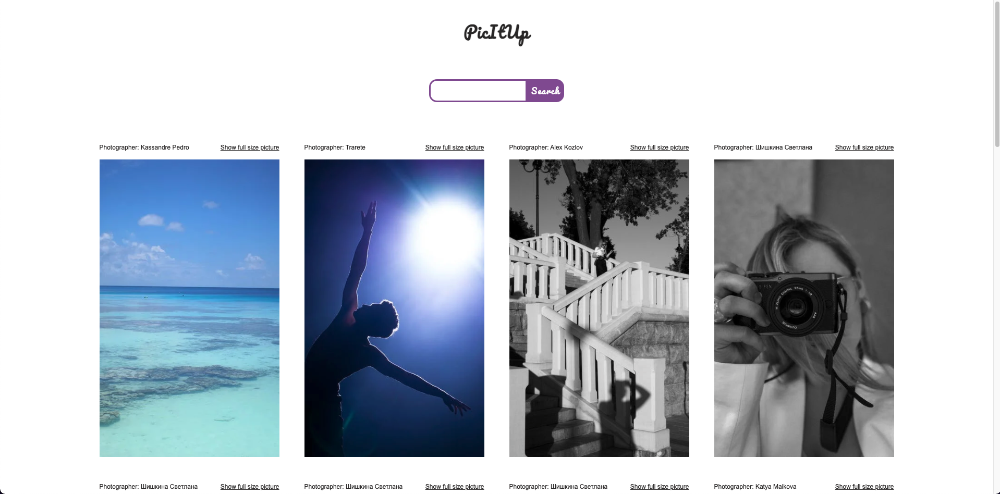
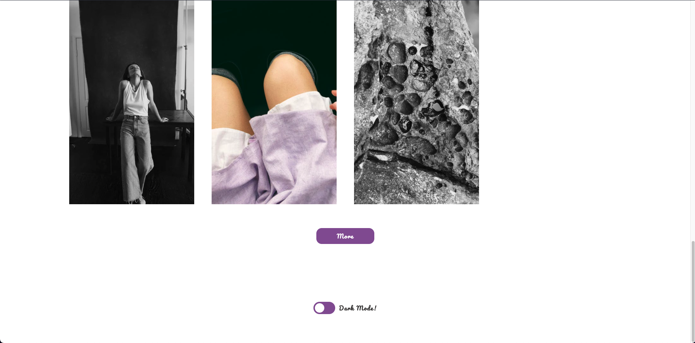

# PicItUp - IMAGE SEARCH ENGINE

Based on the pexels API.

You'll need your own Pexels API Key to run the search engine which must be inserted in the app.js -> const auth!

You can get your **API Key** here: [**Click me**](https://www.pexels.com/de-de/api/)

---

### Example Screenshots

##### Dark mode

##### Light mode

